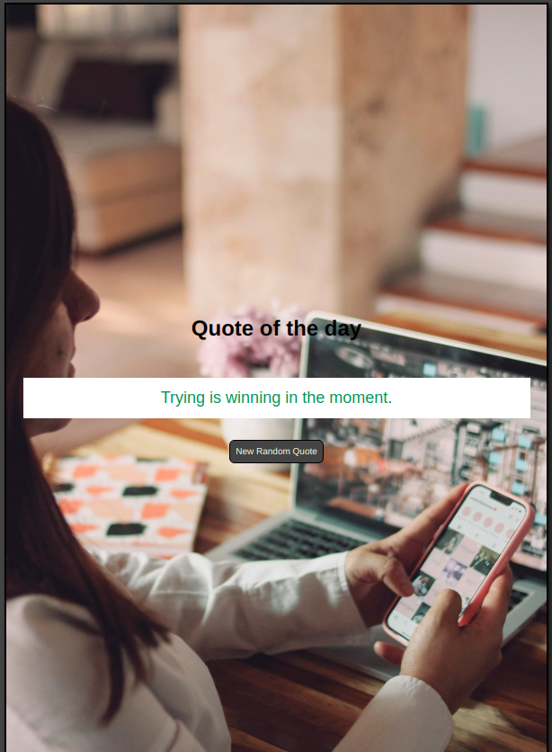

# Quote of the Day

## Link

- Live Site URL: [https://harshita1225.github.io/quote-of-the-day/](https://harshita1225.github.io/quote-of-the-day/)

## Project Specifications

Create random quote app, that shows a random quote when ever the user loads the App(page) or clicks the get random quote button.

1.  Create a function that returns a random quote from the array of
    quotes that's given.

2.  Add a Random Quote button beneath the quote element. When the button is clicked, a new quote should be generated.

3.  with each random quote the background image is also changed randomly.

#### Screenshots

- Desktop layout
  

- Tab Layout
  

### Built with

- Semantic HTML5 markup
- Javascript
- CSS
- Flex box
- Responsive design
- Background images

## Author

- Website - [Harshita Joshi-Github](https://github.com/harshita1225)
